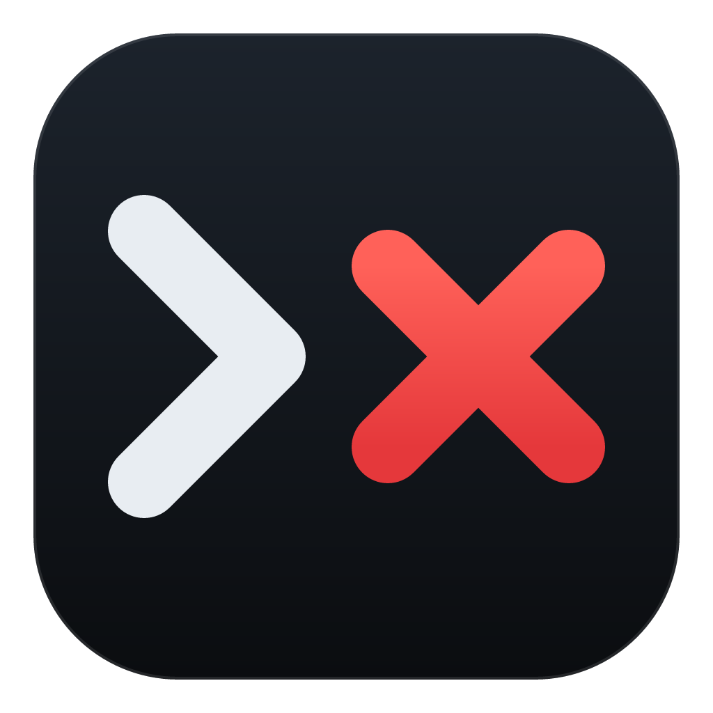
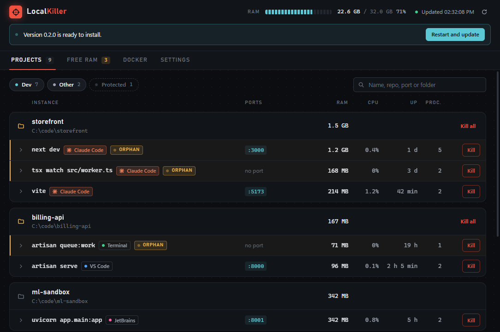
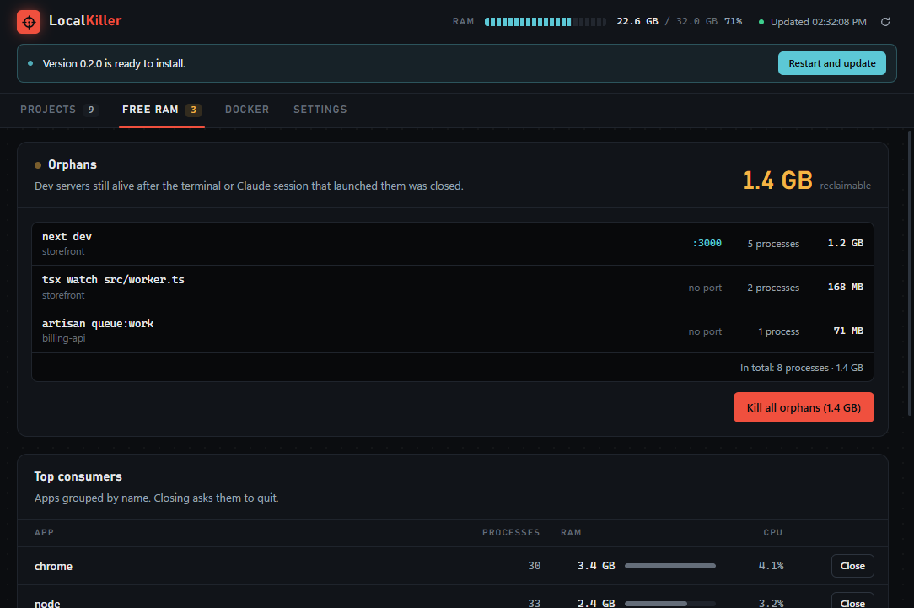
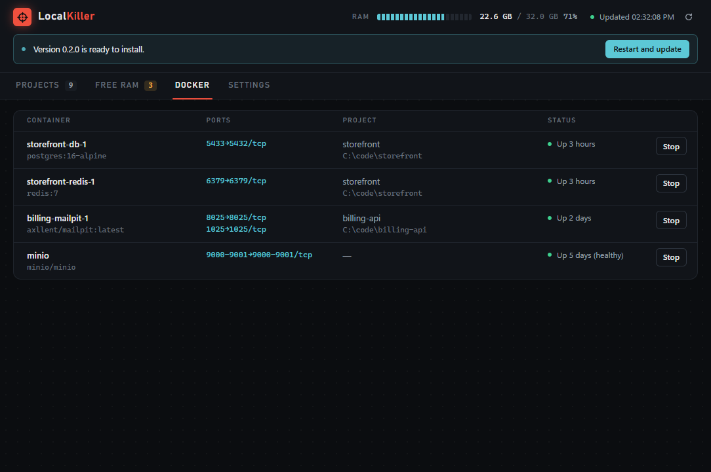
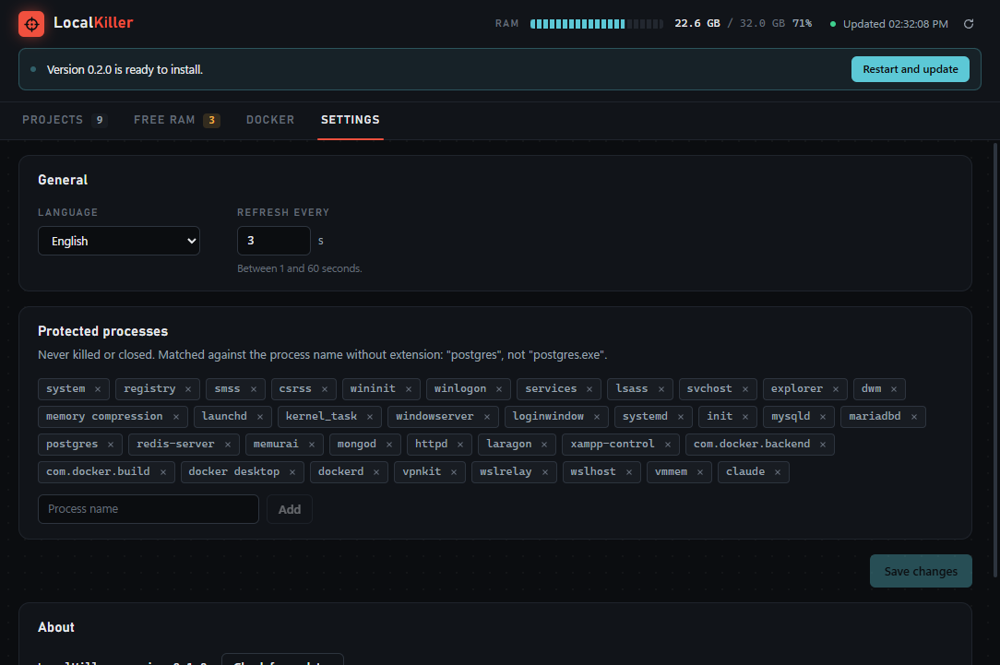

<p align="center">
  
</p>

<h1 align="center">LocalKiller</h1>

<p align="center">
  Encuentra y mata los servidores de desarrollo que quedaron corriendo en localhost.<br>
  <em>Find and kill the localhost dev servers you forgot running.</em>
</p>

<p align="center">
  <a href="https://github.com/Telayna-I/local-killer/releases/latest">Descargar / Download</a> ·
  <a href="#english">English</a>
</p>

---

## Por qué

Cerrás Claude Code, una terminal o el IDE y el `npm run dev`, `vite`, `next dev` o
`php artisan serve` que lanzó sigue vivo: el puerto queda ocupado (`EADDRINUSE`), la RAM se va y
ya no hay ninguna ventana desde la que cortarlo. LocalKiller lista todo lo que escucha en localhost,
lo agrupa por repositorio, te dice quién lo lanzó y lo mata entero, sin tocar nada más.



## Funciones

- **Proyectos agrupados por repo**: cada instancia con sus puertos, PIDs, RAM y CPU, bajo la raíz
  del repo (`.git` más cercano o, si no hay, el manifiesto del proyecto).
- **Origen**: detecta si lo lanzó Claude Code, una terminal o el IDE, incluso si ese proceso ya murió.
- **Huérfanos**: marca los procesos cuyo padre desapareció o cuya sesión de Claude Code se cerró.
- **Matar el árbol entero, con seguridad**: arma su propio árbol de procesos resistente a la
  reutilización de PIDs, mata de las hojas hacia arriba y verifica PID + hora de inicio antes de
  cada kill. Nunca usa `taskkill /T`.
- **Liberar RAM**: mata todos los huérfanos de una vez y muestra los mayores consumidores agrupados
  por aplicación.
- **Docker**: contenedores con puertos publicados (con su proyecto de Compose) y `docker stop`.
- **Lista protegida**: procesos que LocalKiller nunca va a matar.
- **Español / English**.
- **Actualizaciones automáticas** en Windows y Linux.

| Liberar RAM                                   | Docker                                 | Ajustes                                   |
| --------------------------------------------- | -------------------------------------- | ----------------------------------------- |
|  |  |  |

## Instalación

Bajá el archivo de tu sistema desde
[Releases](https://github.com/Telayna-I/local-killer/releases/latest):

| Sistema             | Archivo                                                                         |
| ------------------- | ------------------------------------------------------------------------------- |
| Windows 10/11 (x64) | `LocalKiller-Setup-X.Y.Z.exe`                                                   |
| macOS Apple Silicon | `LocalKiller-X.Y.Z-mac-arm64.dmg`                                               |
| macOS Intel         | `LocalKiller-X.Y.Z-mac-x64.dmg`                                                 |
| Linux x64           | `LocalKiller-X.Y.Z-linux-amd64.deb` o `LocalKiller-X.Y.Z-linux-x86_64.AppImage` |

Las builds todavía **no están firmadas**, así que el sistema avisa la primera vez:

### Windows

- Se instala para tu usuario, sin pedir permisos de administrador.
- SmartScreen muestra "Windows protegió su PC": **Más información → Ejecutar de todas formas**.
- Se actualiza sola: descarga la versión nueva en segundo plano y la instala al cerrar la app.

### macOS

1. Abrí el `.dmg` y arrastrá LocalKiller a Aplicaciones.
2. La primera vez macOS lo bloquea. Andá a **Ajustes del Sistema → Privacidad y seguridad** y tocá
   **Abrir igualmente**. O desde la terminal:

   ```bash
   xattr -dr com.apple.quarantine /Applications/LocalKiller.app
   ```

- Por ahora las actualizaciones son **manuales**: la app avisa cuando hay una versión nueva y abre
  la página de descarga (las actualizaciones automáticas en macOS requieren firma de Apple).

### Linux

- **`.deb`** (recomendado en Ubuntu/Debian): `sudo apt install ./LocalKiller-X.Y.Z-linux-amd64.deb`.
  Instala también el perfil de AppArmor que necesita Ubuntu 24.04+.
- **AppImage**: `chmod +x LocalKiller-*.AppImage && ./LocalKiller-*.AppImage`. Necesita FUSE 2: en
  Ubuntu 24.04 `sudo apt install libfuse2t64` (en 22.04, `libfuse2`). Si Ubuntu 24.04+ la cierra al
  abrir por el sandbox de Chromium, usá el `.deb` o ejecutala con `--no-sandbox`.
- Ambas se actualizan solas (el `.deb` pide la contraseña de administrador para instalar).

## Cómo detecta

1. Lee procesos y sockets TCP en escucha con las APIs nativas de cada sistema (en Windows, Win32
   vía FFI: sin PowerShell ni `netstat`).
2. De cada proceso de desarrollo lee su carpeta de trabajo y sus variables de entorno: la carpeta
   da el repo; las variables delatan a Claude Code (`CLAUDE_CODE_CHILD_SESSION`, `AI_AGENT`,
   `CLAUDE_PID`) aunque la sesión ya no exista. Si no hay pistas, mira los ancestros vivos.
3. Parte de cada puerto en escucha (y de cada runtime de desarrollo huérfano) y sube por los
   wrappers (`npm`, shells) hasta la raíz del lanzamiento: eso es una instancia.
4. Al matar, vuelve a validar todo sobre un árbol recién leído, respeta la lista protegida y mata
   de las hojas hacia la raíz.

Más detalle en [docs/architecture.md](docs/architecture.md) y [docs/decisions.md](docs/decisions.md).

## Desarrollo

Requisitos: Node 24 y npm 11.

```bash
npm install
npm run dev               # app con recarga en caliente
npm test                  # tests unitarios
npm run test:integration  # levanta servidores y huérfanos reales, los detecta y los mata
npm run scan              # imprime lo que la app mostraría en esta máquina
npm run build:unpack      # empaqueta sin instalador en release/
npm run release:check     # build:unpack + smoke test de la app empaquetada (--smoke)
```

`npm run build:win`, `build:mac` y `build:linux` generan los instaladores en `release/`.

## Publicar una versión

1. Subí la versión en `package.json` (por ejemplo `npm version patch --no-git-tag-version`).
2. `git commit -am "chore: release vX.Y.Z"`
3. `git tag vX.Y.Z && git push origin main vX.Y.Z`

El workflow [Release](.github/workflows/release.yml) comprueba que el tag coincida con
`package.json`, crea un borrador de release, compila Windows, macOS (x64 + arm64) y Linux, prueba
cada app empaquetada con `--smoke`, sube instaladores y `latest*.yml`, y publica la release como
_Latest_: desde ahí las apps instaladas se actualizan. Si un job falla, el borrador queda para
revisar y se puede relanzar solo el job fallido.

---

## English

LocalKiller lists everything listening on localhost, groups it by repo, shows who launched it
(Claude Code, a terminal, an IDE) and what it consumes, flags orphans whose parent or Claude Code
session is gone, and kills whole process trees safely (own PID-reuse-safe tree, leaves first,
pid + start time verified before every kill). It also frees RAM (orphans + top consumers), handles
Docker containers, keeps a protected list and speaks Spanish and English.

**Install** from [Releases](https://github.com/Telayna-I/local-killer/releases/latest). Builds are
unsigned for now:

- **Windows**: per-user installer. SmartScreen → **More info → Run anyway**. Auto-updates on quit.
- **macOS**: drag to Applications, then **System Settings → Privacy & Security → Open Anyway**, or
  `xattr -dr com.apple.quarantine /Applications/LocalKiller.app`. Updates are manual for now (the
  app links to the new download).
- **Linux**: prefer the `.deb` (`sudo apt install ./LocalKiller-X.Y.Z-linux-amd64.deb`). The
  AppImage needs FUSE 2 (`sudo apt install libfuse2t64` on Ubuntu 24.04) and may need
  `--no-sandbox` on Ubuntu 24.04+. Both auto-update.

**Develop**: `npm install`, `npm run dev`, `npm test`, `npm run test:integration`, `npm run scan`,
`npm run build:unpack`, `npm run release:check`.

**Release**: bump `version` in `package.json`, commit, `git tag vX.Y.Z`, push the tag. The Release
workflow drafts the GitHub release, builds and smoke-tests all three platforms, uploads the
artifacts and publishes the release, which triggers auto-update.

## License

MIT
